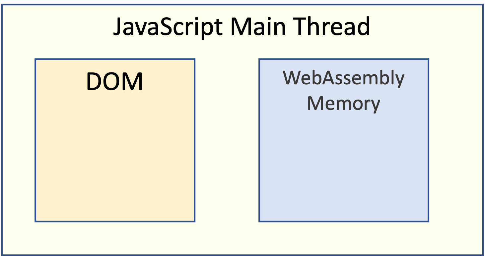
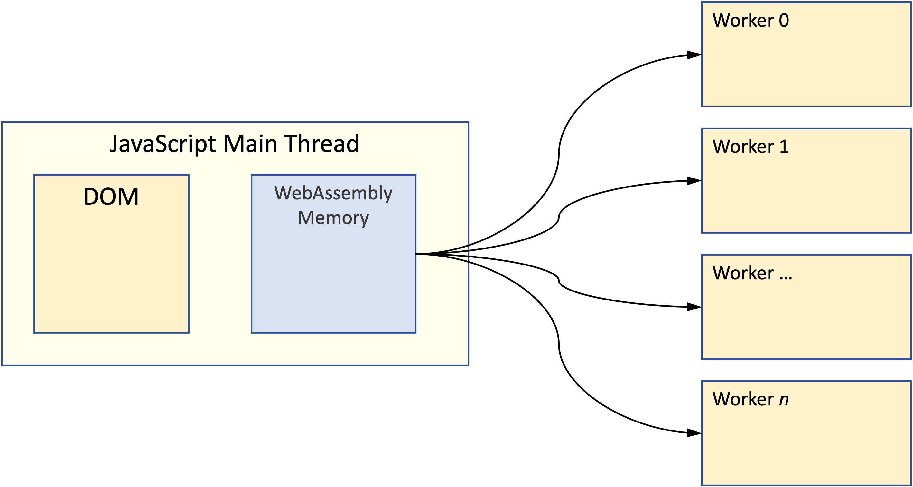
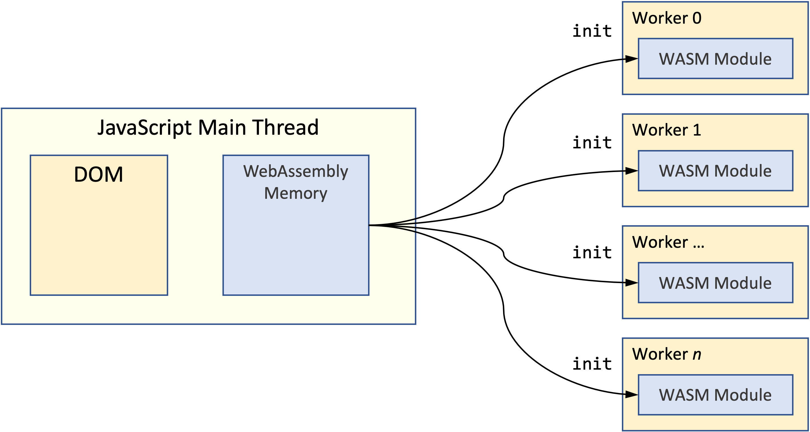

| Previous | | Next
|---|---|---
| [6: Zooming In](../../06%20Zoom%20Image/) | [Up](../../) | 
| [7.1 JavaScript Web Workers](../01/) | [7: WebAssembly and Web Workers](../) | [7.3 Create the Web Worker](../03/) 

### 7.2: Schematic Overview

In order to understand the changes that are needed here, let's first lay out the overall architecture we need to implement.

#### Allocate WebAssembly Memory

The main thread needs to allocate the memory that will be shared with the multiple instances of our WebAssembly module.

#### Generate Worker Threads

The main thread instantiates as many Web Workers as are required for the particular task.  Each Web Worker instance receives a reference to the block of WebAssembly memory.

#### Initialise Each Web Worker

In our case, the first thing we do after all the worker instances have started is to send each an initialisation message.  Upon receiving this message, the worker creates its own instance of the WebAssembly module and, most importantly, passes that module a reference to the shared memory created by the main thread.

Each WebAssembly module instance now has access to the same block of memory.

#### Plot the Image

The second step of the initialisation process is to invoke the `mj_plot` function to create the initial image of the Mandelbrot Set.

The difference now is that the details of the current pixel being plotted are written to shared memory where they can be read by all the running instances of the `mj_plot` function.

In order to know which pixel to plot next, the `mj_plot` function performs an atomic read-modify-write operation in which it reads the next pixel from memory, increments the value and then writes it back.[^1]

Since this modification to shared memory is atomic, we can invoke as many instances of the `mj_plot` function as we like, knowing that they will never interfere with each other by attempting to plot the same pixel.

#### Update the UI from Shared Memory

Once all the instances of `mj_plot` have finished, the main thread then transfers the image data from WebAssembly shared memory into the `canvas` HTML element.

[^1]: All without the need for lock objects or mutexes!

