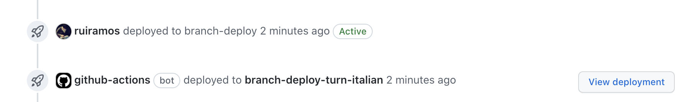

# Next.js deployment on Netlify with Github Actions

## Introduction

Recently, I've been involved in a couple of projects where we've had to quickly
deliver proof-of-concepts of web applications or simple products, and I've been
trying to align on a tech stack and setup that would allow a team to hit the
ground running and deliver web apps in a quick and productive way.

As you might have guessed by the title of this post, this will include
[Next.js](https://nextjs.org), a framework for serverless full-stack apps using
React and deployments on [Netlify](https://netlify.com), using the CI/CD
offering of Github, [Github Actions](https://github.com/features/actions). I'll
talk briefly about the reasoning behind each one next.

Next.js is currently the quickest way to bootstrap a full-stack web app using
React (specially if you're using
[create-next-app](https://nextjs.org/docs/api-reference/create-next-app)). It's
a quite powerful web framework supporting different architectures, from
completely staticly generated sites to server-side rendered ones. It also has a
convention for serverless routes that can easily be deployed to popular
serverless functions FaaS providers -- this seems to be my prefered way of using
it, the "JAM stack" way, where you have a completely static single-page
application front-end backed by serverless functions when you need them.

There's currently a couple of options on where to deploy such an app - from AWS
(using for instance the [serverless
plugin](https://www.serverless.com/blog/serverless-nextjs)) to
[Heroku](https://levelup.gitconnected.com/deploy-your-next-js-app-to-heroku-in-5-minutes-255e829a9966),
but for our use case, static hosting providers with some sort of FaaS offering
work well, and Netlify is one of the best players there, with a huge community
and decent tooling. Netlify supports Next.js deployments out of the box by
converting API routes (and server-side rendered pages) into [Netlify
Functions](https://www.netlify.com/products/functions/), something that's done
behind the scenes via a
[plugin](https://www.npmjs.com/package/@netlify/plugin-nextjs). Basically, it
just works: create a Next.js app, push it to a Github repository, connect that
repository with a Netlify site and you'll have a working continuous delivery
pipeline, including branch and preview (pull request) deployments.

Although this works quite well, it's often better to take control of the build
and deploy process and have it run on a CI/CD pipeline you manage - like Github
Actions! This way, you have flexibility to run whatever other steps your site
requires - from code formatting and linting tools to tests and other 3rd party
service configuration. This presents the problem of us having to recreate some
of that Netlify magic, but as we'll see it's quite manageable.

We'll create a new Next.js site, deploy it to Github, connect it to Netlify and
finally implement the needed Github Action workflows to get our continuous
deployment ball rolling. We'll also integrate some other tools that will improve
developer experience (DX).

If you're after the code you can find it [here](), forking that repository will
give you a functional setup and a great starting point for full stack web
development.


## Putting it all together

### Bootstrapping: Next.js, Github and Netlify

First off, we'll use
[create-next-app](https://nextjs.org/docs/api-reference/create-next-app) to
bootstrap our Next.js application:

```bash 
npx create-next-app your-app-name-here 
```

Next.js will assume you'll want to use `yarn` as a package manager, if that's
not the case there's a `--use-npm` flag you can pass it.

Assuming we've created a Github repository by this point, we simply add the
remote and push to the `main` branch:

```bash 
cd your-app-name-here
git remote add origin YOUR_REPO_URL
git push -u origin main
```

Finally, create a new Netlify site and hook it up to your Github repository
(here's a [guide how to do so](https://www.netlify.com/blog/2016/09/29/a-step-by-step-guide-deploying-on-netlify/)).
You'll see it automatically detects it's a Next.js website and sets the right
build commands and plugins, although we're not going to need that as we'll build
and deploy from Github Actions shortly.

So we'll head off to our `Site Settings` on Netlify and disable builds and
preview deploys:


*Netlify build settings off*


*Netlify deploy previews off*


### Configuring Github Actions

There's two final setting up tasks we need to do before digging in to the CI
pipeline. First, we need to define Netlify build configuration as code, so that
the build command we run on Github Actions knows what to do. For that, create a
`netlify.toml` file on your project folder with the following content:

```toml
[build]
  command = "npm run build"
  publish = "out"

[[plugins]]
  package = "@netlify/plugin-nextjs"
```

We're specifying the build command to run, the location of the publish
directory, and finally that Netlify should run their [Next.js
plugin](https://github.com/netlify/netlify-plugin-nextjs) so the server side
bits are turned into Netlify functions. This is a good time to make sure we have
this plugin installed so CI can run it:

```bash
yarn add -D @netlify/plugin-nextjs
```

We should also install the
[netlify-cli](https://docs.netlify.com/cli/get-started/) as a dev dependency so
we're pinned to the same version locally and on CI:

```bash
yarn add -D netlify-cli
```

The last bit of config has to do with Github secrets and environment variables.
As we're deploying our Netlify site from Github, we'll need to add two secrets
to the environment of the CI runners: the Netlify site ID and an auth token to
authorize the deployment operation. On Github, go to your repository Settings,
then Secrets so you can add your new repository secrets:

 - `NETLIFY_SITE_ID`: which is shown on your site settings on Netlify as `API ID`
 - `NETLIFY_AUTH_TOKEN`: you can generate one from your [user
   page](https://app.netlify.com/user/applications) (they call it Personal
   Access Tokens)


Now that the setup is complete, we'll be creating two different workflows - one
for pull requests that will trigger preview deploys (the preview of a branch on
a new, temporary environment) and another one for production deploys from the
`main` branch to your live site. Although both workflows share a few of the
steps, my experience is that soon they'll become different enough to treat them
seperately. This way you can also use [Github Actions
environments](https://docs.github.com/en/actions/reference/environments) for
managing different values for your env variables.

Starting by the production workflow, create a `.github/workflows/main.yml`
with the following content:

```yaml
name: Production build+deploy

on:
  push:
    branches:
      - main

jobs:
  deploy:
    environment: production
    runs-on: ubuntu-latest
    steps:
      - name: Checkout code
        uses: actions/checkout@v2

      # Cache node modules and next folder
      - name: Caching
        uses: actions/cache@v2
        with:
          path: |
            **/node_modules
            ${{ github.workspace }}/.next/cache
          key: ${{ runner.os }}-modules-${{ hashFiles('**/yarn.lock') }}

      - name: Use Node.js 14.x
        uses: actions/setup-node@v1
        with:
          node-version: 14.x

      - name: Install dependencies
        run: |
          npm install -g yarn
          yarn install

      - name: Run tests
        run: yarn test

      - name: Build project
        id: build-netlify
        run: |
          netlify build
        env:
          NETLIFY_AUTH_TOKEN: ${{ secrets.NETLIFY_AUTH_TOKEN }}
          NETLIFY_SITE_ID: ${{ secrets.NETLIFY_SITE_ID }}

      - name: Deploy to live site!
        id: deploy-netlify
        run: |
          netlify deploy -m 'Production deploy - ${{ github.sha }}' --prod
        env:
          NETLIFY_AUTH_TOKEN: ${{ secrets.NETLIFY_AUTH_TOKEN }}
          NETLIFY_SITE_ID: ${{ secrets.NETLIFY_SITE_ID }}
```

So after our environment and dependencies are installed, we're running tests
(I'm assuming you have them!) and building the project using the Netlify CLI,
and finally deploying with the `--prod` flag, which makes it a production
deployment to the live site. We're using the TOKEN and ID secrets we've defined
earlier on the `build` and `deploy` commands.

The preview workflow is similar, but adds a few steps so Github can show a link
to the deployment on the pull request:

```yaml
name: Pull Request build+deploy

on:
  pull_request:
    branches:
      - main

jobs:
  deploy:
    environment: branch-deploy
    runs-on: ubuntu-latest
    steps:
      - name: Starting deployment
        uses: bobheadxi/deployments@v0.4.3
        id: deployment
        with:
          step: start
          token: ${{ secrets.GITHUB_TOKEN }}
          env: branch-${{ github.head_ref }}
          ref: ${{ github.head_ref }}

      - name: Checkout code
        uses: actions/checkout@v2

      # Cache node modules and next folder
      - name: Caching
        uses: actions/cache@v2
        with:
          path: |
            **/node_modules
            ${{ github.workspace }}/.next/cache
          key: ${{ runner.os }}-modules-${{ hashFiles('**/yarn.lock') }}

      - name: Use Node.js 14.x
        uses: actions/setup-node@v1
        with:
          node-version: 14.x

      - name: Install dependencies
        run: |
          npm install -g yarn
          yarn install

      - name: Run tests
        run: yarn test

      - name: Build project
        id: build-netlify
        run: |
          netlify build
        env:
          NETLIFY_AUTH_TOKEN: ${{ secrets.NETLIFY_AUTH_TOKEN }}
          NETLIFY_SITE_ID: ${{ secrets.NETLIFY_SITE_ID }}

      - name: Preview deploy to Netlify
        id: preview-deploy
        run: |
          COMMAND="netlify deploy -m ${{ github.head_ref }} --alias ${{ github.head_ref }}"
          OUTPUT=$(sh -c "$COMMAND")
          NETLIFY_URL=$(echo "$OUTPUT" | grep -Eo '(http|https)://[a-zA-Z0-9./?=_-]*(--)[a-zA-Z0-9./?=_-]*') #Unique key: --
          NETLIFY_LOGS_URL=$(echo "$OUTPUT" | grep -Eo '(http|https)://app.netlify.com/[a-zA-Z0-9./?=_-]*') #Unique key: app.netlify.com

          echo "::set-output name=NETLIFY_OUTPUT::$OUTPUT"
          echo "::set-output name=NETLIFY_URL::$NETLIFY_URL"
          echo "::set-output name=NETLIFY_LOGS_URL::$NETLIFY_LOGS_URL"
        env:
          NETLIFY_AUTH_TOKEN: ${{ secrets.NETLIFY_AUTH_TOKEN }}
          NETLIFY_SITE_ID: ${{ secrets.NETLIFY_SITE_ID }}

      - name: Update deployment status
        uses: bobheadxi/deployments@v0.4.3
        if: always()
        with:
          step: finish
          token: ${{ secrets.GITHUB_TOKEN }}
          status: ${{ job.status }}
          deployment_id: ${{ steps.deployment.outputs.deployment_id }}
          env_url: ${{ steps.preview-deploy.outputs.NETLIFY_URL }}
          logs: ${{ steps.preview-deploy.outputs.NETLIFY_LOGS_URL }}
```

The main difference is that we're using a Github action to deal with the [Github
Deployments API](https://docs.github.com/en/rest/reference/repos#deployments)
and parsing the URL of the preview deployment from the output of the `netlify
deploy` command (this is similar to how the [Netlify Github
Action](https://github.com/netlify/actions/blob/master/cli/entrypoint.sh) does
it, that's where I got those ~crazy~ beautiful regexs from!). Your PRs (that
successfully build!) will now display a button from where you can access your
preview deployment directly:


*Github Pull Request with Deployment info*


TODO:
 - Environments ?
