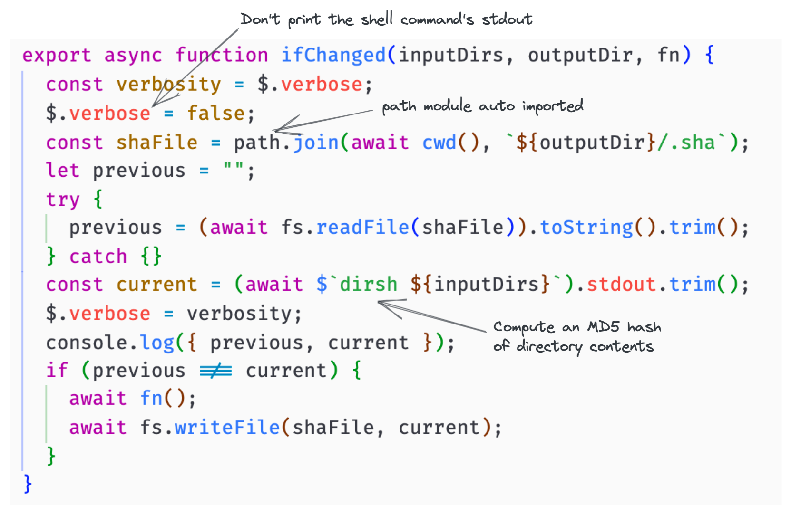
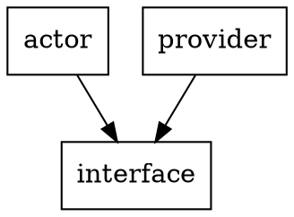

# Write better build scripts

_[Stuart Harris](../) — 11th November 2021_

> We need simple and efficient build automation both locally, when developing, and in CI pipelines. The use case is slightly different but the goals are the same — scripts need to be simple to write, simple to read and understand, and they need to be repeatable, but we don't want to repeat unnecessary work.

It's a challenging problem, with solutions that date back decades.

One of the oldest tools is [`make`][make], which is still extremely popular (and for good reason). However, writing a `Makefile` can get complex quite quickly. It's arcane syntax is challenging, making them hard to write, and, in my opinion, even harder to read. And often, the best feature of `make` is not even used — the ability to only rebuild a target if it's inputs have changed (i.e. have a later modification time). Most people add `.PHONY` to targets and just use `make` as a task runner. This is because it has a built in mechanism for building a Directed Acyclic Graph of dependencies, which is useful, and because the original use case (building C or C++ projects) is not what most people are doing these days (the enlightened are using [Rust][rust] instead).

At the other end of the spectrum, we have tools like [Bazel][bazel] and [Buck][buck]. These are great tools, that do exactly what we want (although they can be quite complex to configure). So why don't we use them instead? I think it's because they need you to go all in. If you want to use either tool, you have to use it everywhere — every dependency needs to be tracked and controlled by the tool. This can work well in some ecosystems, e.g. Java. Not so well for others, e.g. Rust. This is because modern languages typically have their own highly capable toolchains (Rust has [Cargo][cargo], for instance), and using Bazel, for example, on a Rust project means that you need to stop using Cargo (which is simple and mainstream) and use Bazel instead (which is complex and less widely used).

So is there something in the middle?

I really just need 3 things:

1. a powerful scripting language that everyone knows (i.e. not an esoteric [DSL][dsl]), but one that makes it easy to orchestrate shell commands
2. for local development, the ability to describe inputs and detect if they have changed since I last built
3. for CI pipelines, a way to track changed dependencies in a monorepo, and create a build schedule

That's really it.

The [UNIX philosophy][unix_philosophy] is all about small, sharp tools that do one thing and do it well. So, instead of trying to find a single tool that does all three of those things, why not choose 3 tools and combine them in a flexible way to achieve the overall goal?

Reluctant as I am to suggest it, the answer to the first need is probably JavaScript. It's by far the most widely known scripting language. But what about it being easy to orchestrate shell commands? This is where [`zx`][zx] comes into play. It's really cool, making it incredibly easy to orchestrate shell commands from within JavaScript. We'll dig into it shortly, but in a nutshell, I've been blown away by how simple, yet powerful, it is for this job.

Secondly, if I'm rebuilding over and over again on my laptop, I need a tool to describe my inputs and detect if they have changed. This is really quite simple. Everyone uses git now (thankfully) and so describing inputs should be as simple as "every file, under these directories, that is tracked by git". Detecting changes is as simple as "compute a hash of all these inputs, which I can compare with the hash from the last successful build". Fortunately, there is a tool that does precisely that (and it's written in Rust) — [`dirsh`][dirsh]. It's fast, and couldn't really be any simpler. We'll look at how to use this shortly.

Finally, we need a way for my CI pipeline to know what it has to build and in which order. It's becoming more and more popular to use a [monorepo][monorepo], and I highly recommend doing so as a way to make it easier to build reliable software. In a monorepo, most of your immediate dependencies are in the same repository. You can commit changes, atomically, across your whole codebase. Versioning problems evaporate. Stability and reliability become much easier to achieve. If you have a monorepo, and you probably should, [monobuild][monobuild], written by my esteemed colleague, [Viktor Charypar][viktor], is is an incredibly useful tool that allows you to graph your dependencies and schedule builds based on what has changed in the current branch (it's also being [rewritten in rust][monobuild-rs], so will become even better). Monobuild is incredibly useful in a CI pipeline to ensure that everything that has changed (either directly, or because a dependency has changed) is rebuilt. This now gives us everything we need to build simple and efficient pipelines.

## Using `zx`

First install `zx`:

```sh
npm install --global zx
```

Then create a file (e.g. `touch make.mjs`), make it executable (e.g. `chmod +x make.mjs`), and add this at the top:

```sh
#!/usr/bin/env zx
```

Calling into the shell is as simple as this:

```js
await $`pwd`;
```

Check this out:


This is the first run:

```bash
./make.mjs --build
----
Building actor...
{
  previous: 'P5FPQUJTDYU4EWWQMA7MXHBCMM',
  current: 'J62CYREXEFFEM45UKTTJ5Q4XQY'
}
$ cargo build --release
   Compiling wasmcloud-graphql-interface v0.1.0 (/Users/stuartharris/src/wasmCloud/wasmcloud-graphql-provider/interface/rust)
   Compiling pass_through v0.1.0 (/Users/stuartharris/src/wasmCloud/wasmcloud-graphql-provider/actor)
    Finished release [optimized] target(s) in 4.87s
$ wash claims sign target/wasm32-unknown-unknown/release/pass_through.wasm --cap $'stuart-harris:graphql-provider' --cap $'wasmcloud:builtin:logging' --cap $'wasmcloud:httpserver' --name pass_through --ver 0.1.0 --rev 0 --destination build/pass_through_s.wasm
Successfully signed build/pass_through_s.wasm with capabilities: stuart-harris:graphql-provider,wasmcloud:builtin:logging,wasmcloud:httpserver
$ wash claims inspect build/pass_through_s.wasm

                             pass_through - Module
  Account           ADHSOZVDL2ZLVX5UXBSGKNLN5UOMU5MPDHN3UQTQ6DYT5TFZ7HGLGIUP
  Module            MA5PVZ6QNJK5TELQHPQGICJJ2EFVH7YDVXKF2NCUTYGSVVHUCEOL5UW6
  Expires                                                              never
  Can Be Used                                                    immediately
  Version                                                          0.1.0 (0)
  Call Alias                                                       (Not set)
                                 Capabilities
  stuart-harris:graphql-provider
  wasmcloud:builtin:logging
  HTTP Server
                                     Tags
  None
```

And the second run:

```bash
./make.mjs --build
----
Building actor...
{
  previous: 'J62CYREXEFFEM45UKTTJ5Q4XQY',
  current: 'J62CYREXEFFEM45UKTTJ5Q4XQY'
}
$ wash claims inspect build/pass_through_s.wasm

                             pass_through - Module
  Account           ADHSOZVDL2ZLVX5UXBSGKNLN5UOMU5MPDHN3UQTQ6DYT5TFZ7HGLGIUP
  Module            MA5PVZ6QNJK5TELQHPQGICJJ2EFVH7YDVXKF2NCUTYGSVVHUCEOL5UW6
  Expires                                                              never
  Can Be Used                                                    immediately
  Version                                                          0.1.0 (0)
  Call Alias                                                       (Not set)
                                 Capabilities
  stuart-harris:graphql-provider
  wasmcloud:builtin:logging
  HTTP Server
                                     Tags
  None
```

Parsing JSON is a doddle:

```js
const metadata = JSON.parse(
  await $`cargo metadata --no-deps --format-version 1`
);
const projectName = metadata.packages[0].name;
```

Anyway, you get the idea. Very powerful.

## Using `dirsh`

First install `dirsh`:

```sh
cargo install dirsh
```

Calling `dirsh` on its own will walk recursively from the current directory, feeding file contents, with their modification times and modes, into the digest, and write it to stdout:

```sh
dirsh
JLAU7VF3L5IXQ5L66AXEILCHE4
```

This is how I'm calling it from `zx`:



Pretty cool.

## Using `monobuild`

First install `monobuild`:

```sh
cargo install --git https://github.com/charypar/monobuild
```

Add some files called `Dependencies`, into your monorepo (I've made `interface` a strong dependency as it has some codegen that needs to run):

```sh
bat */Dependencies
───────┬──────────────────────────────────────────
       │ File: actor/Dependencies
───────┼──────────────────────────────────────────
   1   │ !interface
───────┴──────────────────────────────────────────
───────┬──────────────────────────────────────────
       │ File: interface/Dependencies   <EMPTY>
───────┴──────────────────────────────────────────
───────┬──────────────────────────────────────────
       │ File: provider/Dependencies
───────┼──────────────────────────────────────────
   1   │ !interface
───────┴──────────────────────────────────────────
```

Then get a build schedule based on what has changed (in git) since you cut your branch (or since the `HEAD^1` commit, if you're on `main`):

```sh
monobuild diff --dot
```

If only `interface` had changed, this would be the schedule:



If only `actor` had changed, this would be the schedule:


[bazel]: https://bazel.build/
[buck]: https://buck.build/
[cargo]: https://doc.rust-lang.org/cargo/
[dirsh]: https://github.com/christian-blades-cb/dirsh
[dsl]: https://en.wikipedia.org/wiki/Domain-specific_language
[make]: https://www.gnu.org/software/make/
[monobuild-rs]: https://github.com/charypar/monobuild/tree/master/rs
[monobuild]: https://github.com/charypar/monobuild
[monorepo]: https://blog.red-badger.com/why-dont-you-have-a-monorepo
[rust]: https://www.rust-lang.org/
[unix_philosophy]: https://en.wikipedia.org/wiki/Unix_philosophy
[viktor]: https://twitter.com/charypar
[zx]: https://github.com/google/zx
