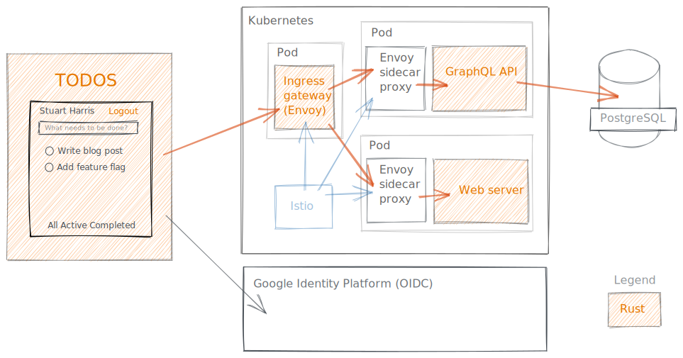

# Full-stack Rust

_[Stuart Harris](../) — 23rd June 2020_

For a while I've been wondering how practical it is to use [Rust][rust] both for web applications (and services) on the server _and_ for web UI in the browser. So I've been spending quite a lot of time exploring the developer experience, whilst trying to understand whether Rust in the browser is actually a good idea! TLDR; I think it _is_, but with a few caveats.

## Some background

[Viktor Chaypar][charypar] and I have been working on an open source [feature targeting project][feature-targeting], which currently consists of a [Web Assembly (WASM)][wasm] filter for [Envoy][envoy] sidecars in [Istio][istio], which we've written entirely in Rust. In this spirit, I thought it would be nice to write a demo application (also entirely in Rust) that we could use to demonstrate the feature-targeting filter in action. I make no excuses for this rather self-indulgent experiment!

The demo application expands on the ubiquitous [TODO MVC][todomvc] application, by adding a database and user authentication. It seemed like a good idea because I wouldn't have to write much CSS, and it's simple enough not to get in the way of what I was really trying to prove – that Rust is amazing, wherever you choose to use it. 😍

## The architecture

This is a rough diagram of the setup (drawn in the excellent [excalidraw][excalidraw], where all the orange boxes are either fully, or partially (in the case of the gateway), written in Rust:



The browser runs the TODO client, which is compiled to WASM. The Envoy filter is also compiled to wasm and injected (by Istio) into either the ingress gateway or the relevant sidecar (either approach is sound). The GraphQL API and the Web server are lightweight and fast. Locally, round trips through the API release build and the database are about 2ms (not a typo!).

## The crates

These are some of the [crates][crates] we used in each component:

- _The Web UI_

  - [`seed`][seed] – I moved from [`yew`][yew] (which is also an Elm-like framework) as I found `seed` to be "rustier", with less magic and more power from using macros instead of JSX, which seemed to only be there for the comfort of those used to React.

  - [`graphql-client`][graphql-client] – This gives us macros that create derived types on the client side (based on the queries and the GraphQL schema) and an integrated client.

  - [`wasm-pack`][wasm-pack] – This is an amazing toolchain for building the WASM binary for the browser – you literally just do this:

    ```sh
    wasm-pack build --target web
    ```

- _The Envoy filter_

  - [`proxy-wasm`][proxy-wasm] – an emerging ABI for WASM filters in proxies

- _The GraphQL API_

  - [`async-graphql`][async-graphql] – I moved here from [`juniper`][juniper], which has fallen behind a bit IMO.

  - [`sqlx`][sqlx] – I moved here from [`diesel`][diesel] because I don't really like ORMs. Instead I get to specify the actual SQL queries, which are type-checked at compile-time against the schema, and results are automatically deserialized into my types. It's really cool, as I hope you'll see below.

  - [`tide`][tide] – this is an idiomatic Rust web server, and very familiar if you're used to Express in JS-land. I also really like its sister HTTP client, [`surf`][surf], which has a really nice API.

  - [`smol`][smol] – this crate is pure genius! I've used [`tokio`][tokio] and [`async-std`][async-std], both of which are excellent async runtimes, but `smol` takes it to another level. Small, fast, complete, flexible and simple, with no `unsafe` – *and* it integrates seemlessly with crates that are already in either of the `tokio` or `async-std` camps.

- _The Web Server_

  - [`tide`][tide]

  - [`smol`][smol]

## The detail

### Envoy filter

You can read all about the [Envoy][envoy] proxy filter in our [`feature-targeting`][feature-targeting] repo, so I won't repeat that here. Have a read though, because it's super interesting to now be able to extend the [Istio][istio] data plane in this way.

### GraphQL API

I've written many APIs in my time, and I can honestly say that this (as simple as it is) has been the most enjoyable experience.

#### Data layer

For example, the data layer is super thin when using [`sqlx`][sqlx]:

```rust
use anyhow::Result;
use sqlx::{types::Uuid, PgPool};

#[derive(Clone)]
pub struct Todo {
    pub id: Uuid,
    pub title: String,
    pub completed: bool,
}

impl Todo {
    pub async fn find_all(pool: &PgPool) -> Result<Vec<Todo>> {
        let todos = sqlx::query_file_as!(Todo, "sql/find_all.sql",)
            .fetch_all(pool)
            .await?;

        Ok(todos)
    }

    pub async fn find_by_id(id: Uuid, pool: &PgPool) -> Result<Todo> {
        let todo = sqlx::query_file_as!(Todo, "sql/find_by_id.sql", id,)
            .fetch_one(pool)
            .await?;

        Ok(todo)
    }

    pub async fn create(title: String, pool: &PgPool) -> Result<Todo> {
        let todo = sqlx::query_file_as!(Todo, "sql/create.sql", title)
            .fetch_one(pool)
            .await?;

        Ok(todo)
    }

    pub async fn update(
        id: Uuid,
        title: Option<String>,
        completed: Option<bool>,
        pool: &PgPool,
    ) -> Result<Todo> {
        let todo = sqlx::query_file_as!(Todo, "sql/update.sql", title, completed, id)
            .fetch_one(pool)
            .await?;

        Ok(todo)
    }

    pub async fn delete(id: Uuid, pool: &PgPool) -> Result<Todo> {
        let todo = sqlx::query_file_as!(Todo, "sql/delete.sql", id)
            .fetch_one(pool)
            .await?;

        Ok(todo)
    }
}
```

The `sqlx::query_file_as!()` macro ensures that the SQL in the specified file is correct against the schema at compile time, that the parameters are of the right types, and that the response is deserialized into the specified type.

This is really 😎.

The only downside is that you have to have a (probably local) instance of, for example, PostgreSQL running with a database and relevant tables created from the specified schema.

Our SQL queries return the modified record (which is nice for GraphQL mutations). This is `sql/update.sql`:

```sql
UPDATE todos
SET title = COALESCE($1, title),
    completed = COALESCE($2, completed)
WHERE id = $3
RETURNING id,
    title,
    completed
```

#### GraphQL server

Nothing stands still in the Rust ecosystem. Not long ago, [`juniper`][juniper] was the go to choice for a GraphQL server. But I had to specify the github repo in my `Cargo.toml` to get async support, and it all feels a bit messy now. I was happy to find [`async-graphql`][async-graphql], which is similar and more modern, easy to switch to, and has a nicer and simpler API.

The introduction of `SimpleObject` for objects whose fields don't, themselves, have resolvers is a nice touch. The new [GraphQL Playground][graphql-playground], which is the default, is a much improved experience (when compared to the older [GrapiQL][graphiql] UI), and makes working with the API a dream.

When we need to handle an incoming GraphQL query, we simply increment the reference count on the schema (which is in the request's state) and pass it into the executor:

```rust
pub async fn handle_graphql(req: Request<State>) -> tide::Result {
    let schema = req.state().schema.clone();
    async_graphql_tide::graphql(req, schema, |query_builder| query_builder).await
}
```

The model is simple:

```rust
#[SimpleObject(desc = "A todo")]
pub struct Todo {
    #[field(desc = "The id of the todo")]
    id: ID,
    #[field(desc = "The title of the todo")]
    title: String,
    #[field(desc = "Is the todo completed?")]
    completed: bool,
}
```

and the actual queries are defined like this:

```rust
pub struct QueryRoot;

#[Object]
impl QueryRoot {
    #[field(desc = "Get all Todos")]
    async fn todos(&self, context: &Context<'_>) -> FieldResult<Vec<Todo>> {
        let todos = db::Todo::find_all(&context.data()).await?;
        Ok(todos.iter().cloned().map(Into::into).collect())
    }

    #[field(desc = "Get Todo by id")]
    async fn todo(&self, context: &Context<'_>, id: ID) -> FieldResult<Todo> {
        let id = Uuid::parse_str(id.as_str())?;
        let todo = db::Todo::find_by_id(id, &context.data()).await?;
        Ok(todo.into())
    }
}
```

If you ignore the lifetime type parameter on `Context`, I think you could probably say that this is simpler than the JavaScript equivalent! And this code generates the schema, and includes full error handling (it's easy to miss the `?` operator).

Mutations follow the same pattern and are just as simple.

#### Web server

So to tie it all up, we just need to create a [`tide`][tide] app, passing in a pool of database connections as state. Notice how the concept of middleware in `tide` is almost identical to that of `express-js`. This is `lib.rs`:

```rust
use anyhow::Result;
use http_types::headers::HeaderValue;
use sqlx::PgPool;
use tide::{
    security::{CorsMiddleware, Origin},
    Redirect, Server,
};

mod db;
mod graphql;

pub async fn create_app(database_url: &str) -> Result<Server<graphql::State>> {
    let connection_pool = PgPool::new(database_url).await?;

    let mut app = Server::with_state(graphql::State::new(connection_pool));

    app.middleware(
        CorsMiddleware::new()
            .allow_methods(
                "GET, POST, OPTIONS"
                    .parse::<HeaderValue>()
                    .expect("could not parse as HTTP header value"),
            )
            .allow_origin(Origin::from("*"))
            .allow_credentials(false),
    );

    app.at("/").get(Redirect::permanent("/graphiql"));
    app.at("/graphql").post(graphql::handle_graphql);
    app.at("/graphiql").get(graphql::handle_graphiql);

    Ok(app)
}
```

And then all that's left to do is instantiate the web server (this is `main.js`):

```rust
use anyhow::Result;
use dotenv::dotenv;
use std::env;

fn main() -> Result<()> {
    dotenv().ok();
    env_logger::init();

    let database_url = env::var("DATABASE_URL")?;

    smol::run(start(&database_url))
}

async fn start(database_url: &str) -> Result<()> {
    let app = todomvc_api::create_app(database_url).await?;
    app.listen("0.0.0.0:3030").await?;
    Ok(())
}
```

That's actually it! There is literally nothing more to it.

A GraphQL API with queries and mutations (not shown here, but just as easy), backed onto a SQL database, that can turn around queries in 2ms – in just 227 lines of Rust. Check out the full source code at https://github.com/redbadger/feature-targeting/samples/todomvc_api.

[async-graphql]: https://docs.rs/async-graphql/1.16.0/async_graphql/
[async-std]: https://docs.rs/async-std
[charypar]: https://twitter.com/charypar
[crates]: https://crates.io
[diesel]: https://github.com/diesel-rs/diesel
[envoy]: https://www.envoyproxy.io/
[excalidraw]: https://excalidraw.com/
[feature-targeting]: https://github.com/redbadger/feature-targeting
[graphiql]: https://github.com/graphql/graphiql
[graphql-client]: https://github.com/graphql-rust/graphql-client
[graphql-playground]: https://github.com/prisma-labs/graphql-playground
[istio]: https://istio.io/
[juniper]: https://github.com/graphql-rust/juniper
[proxy-wasm]: https://github.com/proxy-wasm/spec
[rust]: https://www.rust-lang.org/
[seed]: https://github.com/seed-rs/seed
[smol]: https://github.com/stjepang/smol
[sqlx]: https://github.com/launchbadge/sqlx
[surf]: https://github.com/http-rs/surf
[tide]: https://github.com/http-rs/tide
[todomvc]: http://todomvc.com/
[tokio]: https://docs.rs/tokio
[wasm-pack]: https://rustwasm.github.io/wasm-pack/
[wasm]: https://webassembly.org/
[yew]: https://github.com/yewstack/yew
