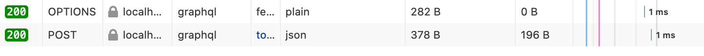
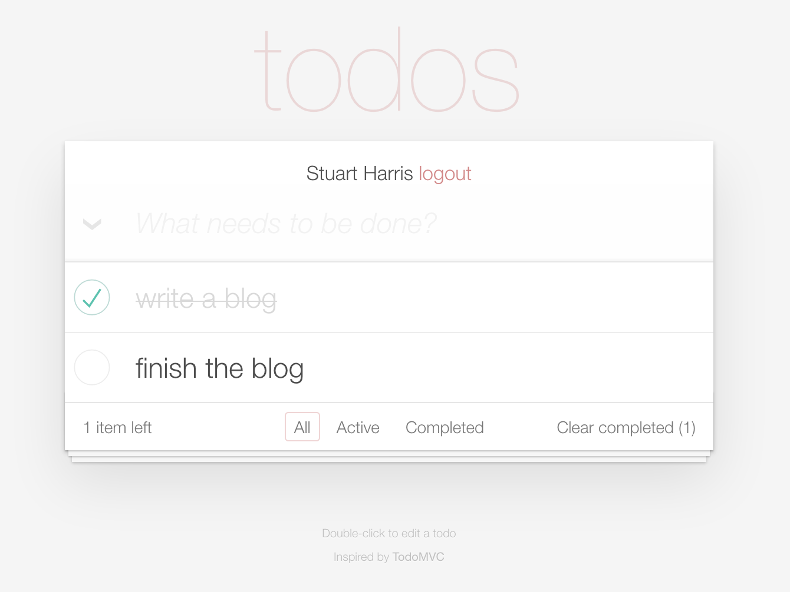

# Full-stack Rust

_[Stuart Harris](../) — 23rd June 2020_

For a while I've been wondering how practical it is to use [Rust][rust] both for web applications (and services) on the server _and_ for web UI in the browser. So I've been spending quite a lot of time exploring the developer experience, whilst trying to understand whether Rust in the browser is actually a good idea! TLDR; it just works and it's a wonderful experience!.

## Some background

[Viktor Chaypar][charypar] and I have been working on an open source [feature targeting project][feature-targeting], which currently consists of a [Web Assembly (WASM)][wasm] filter for [Envoy][envoy] sidecars in [Istio][istio], which we've written entirely in Rust. In this spirit, I thought it would be nice to write a demo application (also entirely in Rust) that we could use to demonstrate the feature-targeting filter in action. I make no excuses for this rather self-indulgent experiment!

The demo application expands on the ubiquitous [TODO MVC][todomvc] application, by adding a database and user authentication. It seemed like a good idea because I wouldn't have to write much CSS, and it's simple enough not to get in the way of what I was really trying to prove – that Rust is amazing, wherever you choose to use it. 😍

## The architecture

This is a rough diagram of the setup (drawn in the excellent [excalidraw][excalidraw]), where all the orange boxes are either fully, or partially (in the case of the gateway), written in Rust:


The browser runs the TODO client, which is compiled to WASM. The Envoy filter is also compiled to wasm and injected (by Istio) into either the ingress gateway or the relevant sidecar (either approach is sound). The GraphQL API and the Web server are lightweight and fast. On my laptop, round trips through a release build of the API and a PostgreSQL database, take roughly a millisecond!

## The crates

These are some of the [crates][crates] we used in each component:

- _The Web UI_

  - [`seed`][seed] – I moved from [`yew`][yew] (which is also an [Elm][elm]-like framework) as I found `seed` to be "rustier", with less magic and more power from using macros instead of JSX (which seemed to only be there for the comfort of those used to React).

  - [`graphql-client`][graphql-client] – This gives us macros that create derived types on the client side (based on the queries and the GraphQL schema) and an integrated client.

  - [`wasm-pack`][wasm-pack] – This is an amazing toolchain for building the WASM binary for the browser – you literally just do this:

    ```sh
    wasm-pack build --target web
    ```

- _The Envoy filter_

  - [`proxy-wasm`][proxy-wasm] – an emerging ABI for WASM filters in proxies

- _The GraphQL API_

  - [`async-graphql`][async-graphql] – I moved here from [`juniper`][juniper], which has fallen behind a bit IMO.

  - [`sqlx`][sqlx] – I moved here from [`diesel`][diesel] because I don't really like ORMs. Instead I get to specify the actual SQL queries, which are type-checked at compile-time against the schema, and results are automatically deserialized into my types. It's really cool, as I hope you'll see below.

  - [`tide`][tide] – this is an idiomatic Rust web server, and very familiar if you're used to [Express][express] in JS-land. I also really like its sister HTTP client, [`surf`][surf], which has a really nice API.

  - [`smol`][smol] – this crate is pure genius! I've used [`tokio`][tokio] and [`async-std`][async-std], both of which are excellent async runtimes, but `smol` takes it to another level. Small, fast, complete, flexible and simple, with no `unsafe` – *and* it integrates seamlessly with crates that are already in either of the `tokio` or `async-std` camps.

- _The Web Server_

  - [`tide`][tide]

  - [`smol`][smol]

## The detail

### Envoy filter

You can read all about the [Envoy][envoy] proxy filter in our [`feature-targeting`][feature-targeting] repo, so I won't repeat that here. Have a read though, because it's super interesting that we can now extend the [Istio][istio] data plane with Rust and WebAssembly.

### GraphQL API

I've written many APIs in my time, and I can honestly say that this (as simple as it is) has been the most enjoyable experience.

#### Data layer

For example, the data layer is super thin when using [`sqlx`][sqlx]:

```rust
use anyhow::Result;
use sqlx::{types::Uuid, PgPool};

#[derive(Clone)]
pub struct Todo {
    pub id: Uuid,
    pub title: String,
    pub completed: bool,
}

impl Todo {
    pub async fn find_all(pool: &PgPool) -> Result<Vec<Todo>> {
        let todos = sqlx::query_file_as!(Todo, "sql/find_all.sql",)
            .fetch_all(pool)
            .await?;

        Ok(todos)
    }

    pub async fn find_by_id(id: Uuid, pool: &PgPool) -> Result<Todo> {
        let todo = sqlx::query_file_as!(Todo, "sql/find_by_id.sql", id,)
            .fetch_one(pool)
            .await?;

        Ok(todo)
    }

    pub async fn create(title: String, pool: &PgPool) -> Result<Todo> {
        let todo = sqlx::query_file_as!(Todo, "sql/create.sql", title)
            .fetch_one(pool)
            .await?;

        Ok(todo)
    }

    pub async fn update(
        id: Uuid,
        title: Option<String>,
        completed: Option<bool>,
        pool: &PgPool,
    ) -> Result<Todo> {
        let todo = sqlx::query_file_as!(Todo, "sql/update.sql", title, completed, id)
            .fetch_one(pool)
            .await?;

        Ok(todo)
    }

    pub async fn delete(id: Uuid, pool: &PgPool) -> Result<Todo> {
        let todo = sqlx::query_file_as!(Todo, "sql/delete.sql", id)
            .fetch_one(pool)
            .await?;

        Ok(todo)
    }
}
```

The `sqlx::query_file_as!()` macro ensures that the SQL in the specified file is correct against the schema at compile time, that the parameters are of the right types, and that the response is deserialized into the specified type.

This is really 😎.

The only downside is that you have to have a (probably local) instance of, for example, PostgreSQL running with a database and relevant tables created from the specified schema.

Our SQL queries return the modified record (which is nice for GraphQL mutations). This is `sql/update.sql`:

```sql
UPDATE todos
SET title = COALESCE($1, title),
    completed = COALESCE($2, completed)
WHERE id = $3
RETURNING id,
    title,
    completed
```

#### GraphQL server

Nothing stands still in the Rust ecosystem. Not long ago, [`juniper`][juniper] was the go to choice for a GraphQL server. But I had to specify the github repo in my `Cargo.toml` to get async support, and it all feels a bit messy now. I was happy to find [`async-graphql`][async-graphql], which is similar and more modern, easy to switch to, and has a nicer and simpler API.

The introduction of `SimpleObject` for objects whose fields don't, themselves, have resolvers is a nice touch. The new [GraphQL Playground][graphql-playground], which is the default, is a much improved experience (when compared to the older [GraphiQL][graphiql] UI), and makes working with the API a dream.

When we need to handle an incoming GraphQL query, we simply increment the reference count on the schema (which is in the request's state) and pass it into the executor:

```rust
pub async fn handle_graphql(req: Request<State>) -> tide::Result {
    let schema = req.state().schema.clone();
    async_graphql_tide::graphql(req, schema, |query_builder| query_builder).await
}
```

The model is simple:

```rust
#[SimpleObject(desc = "A todo")]
pub struct Todo {
    #[field(desc = "The id of the todo")]
    id: ID,
    #[field(desc = "The title of the todo")]
    title: String,
    #[field(desc = "Is the todo completed?")]
    completed: bool,
}
```

and the actual queries are defined like this:

```rust
pub struct QueryRoot;

#[Object]
impl QueryRoot {
    #[field(desc = "Get all Todos")]
    async fn todos(&self, context: &Context<'_>) -> FieldResult<Vec<Todo>> {
        let todos = db::Todo::find_all(&context.data()).await?;
        Ok(todos.iter().cloned().map(Into::into).collect())
    }

    #[field(desc = "Get Todo by id")]
    async fn todo(&self, context: &Context<'_>, id: ID) -> FieldResult<Todo> {
        let id = Uuid::parse_str(id.as_str())?;
        let todo = db::Todo::find_by_id(id, &context.data()).await?;
        Ok(todo.into())
    }
}
```

If you ignore the lifetime type parameter on `Context`, I think you could probably say that this is simpler than the JavaScript equivalent! And this code generates the schema, and includes full error handling (it's easy to miss the `?` operator).

Mutations follow the same pattern and are just as simple.

#### Web server

So to tie it all up, we just need to create a [`tide`][tide] app, passing in a pool of database connections as state. Notice how the concept of middleware in `tide` is almost identical to that of `express-js`. This is `lib.rs`:

```rust
use anyhow::Result;
use http_types::headers::HeaderValue;
use sqlx::PgPool;
use tide::{
    security::{CorsMiddleware, Origin},
    Redirect, Server,
};

mod db;
mod graphql;

pub async fn create_app(database_url: &str) -> Result<Server<graphql::State>> {
    let connection_pool = PgPool::new(database_url).await?;

    let mut app = Server::with_state(graphql::State::new(connection_pool));

    app.middleware(
        CorsMiddleware::new()
            .allow_methods(
                "GET, POST, OPTIONS"
                    .parse::<HeaderValue>()
                    .expect("could not parse as HTTP header value"),
            )
            .allow_origin(Origin::from("*"))
            .allow_credentials(false),
    );

    app.at("/").get(Redirect::permanent("/graphiql"));
    app.at("/graphql").post(graphql::handle_graphql);
    app.at("/graphiql").get(graphql::handle_graphiql);

    Ok(app)
}
```

And then all that's left to do is instantiate the web server (this is `main.js`):

```rust
use anyhow::Result;
use dotenv::dotenv;
use std::env;

fn main() -> Result<()> {
    dotenv().ok();
    env_logger::init();

    let database_url = env::var("DATABASE_URL")?;

    smol::run(start(&database_url))
}

async fn start(database_url: &str) -> Result<()> {
    let app = todomvc_api::create_app(database_url).await?;
    app.listen("0.0.0.0:3030").await?;
    Ok(())
}
```

That's actually it! There is literally nothing more to it.

A GraphQL API with queries and mutations (not shown here, but just as easy), backed onto a SQL database, that can turn around queries in a millisecond...



... and it comes in at under 200 lines of Rust. Check out the full source code at [https://github.com/redbadger/feature-targeting/samples/todomvc_api][todomvc_api].

### Web UI

This is the fun bit!

All modern web browsers support [WebAssembly][wasm], and Firefox has supported it since March 2017. Currently [91.39%][caniuse] of requests made globally are from browsers that support WASM. This might not be enough for every use-case, especially internal apps at Microsoft shops (IE 11 is, as always, the main offender here), but it does feel to me that the time has come for us to be able to have WASM web apps, and I would flippantly suggest that those using IE11 should use something else instead!

Additionally, there is currently a beautiful love affair ❤️ going on between Rust and WASM. The toolchain is superb, with `wasm-*` targets fully supported. And as with all things Rust, there is a [book about it][rust-and-wasm-book].

When I was adding auth support to the Todo MVC app, I figured it'd be nice to do [OAuth2 implicit flow][oauth2-implicit]. I wanted to generate a real [`JWT`][jwt] token, so that we can use the claims inside it (e.g. email) to control both client-side and server-side features. Strictly speaking, these days, we should, instead, use the [OAuth2 authorization code flow][oauth2-code] with the [PKCE][pkce] (pronounced like the word "pixie") extension. As with the implicit flow, we don't need to give the client secret to the browser. But because this is only a demo I decided to not worry too much (I don't even validate or renew expired tokens, but you definitely should in a real app).

OK let's get on with it.

#### Bootstrapping a Rust WASM app

I guess the place to start is with the `Cargo.toml` which needs to specify that our library will use C-like FFI, and that we want `wasm-bindgen` to generate the interface for the WASM runtime. Here are the relevant bits:

```toml
[lib]
crate-type = ["cdylib"]

[dependencies]
wasm-bindgen = "0.2.63"
```

Then we just need to annotate a function as our entry point. This is where we create the [`seed`][seed] app:

```rust
#[wasm_bindgen(start)]
pub fn create_app() {
    App::builder(update, view)
        .after_mount(after_mount)
        .build_and_start();
}
```

We also need to load the binary in the web page and mount our app on a DOM node (the default `id` for the mount-point is `app`). These are the relevant parts of `index.html`:

```html
<!DOCTYPE html>
<html lang="en" data-framework="rust">
  <body>
    <section id="app" class="todoapp"></section>
    <script type="module">
      import init from "/pkg/todomvc.js";
      init("/pkg/todomvc_bg.wasm");
    </script>
  </body>
</html>
```

We can easily build the WASM module using [`wasm-pack`][wasm-pack] (by default into a file named after the crate, and in a directory named `pkg`):

```sh
wasm-pack build --target web
```

and host it using a simple static webserver (for now):

```sh
npm install -g httpserver
httpserver&
```

#### The `seed` application

It's good that there are a few choices of web frameworks in the Rust ecosystem. We mentioned [`yew`][yew], which is probably the most popular. We're using [`seed`][seed] here because I don't feel the need for `jsx` syntax. IMO it complicates the boundaries between the declarative and imperative parts of the view. It seems clearer just to stay in pure Rust syntax as much as possible. Rust has a very powerful macro subsystem, and I think `seed` makes good use of its macros.

For example, in the screenshot, look at the "All", "Active" and "Completed" filter buttons, and at how they are implemented in the code-box below:



```rust
fn view_filters(current_filter: TodoFilter) -> Node<Msg> {
    ul![
        C!["filters"],
        view_filter("All", TodoFilter::All, current_filter),
        view_filter("Active", TodoFilter::Active, current_filter),
        view_filter("Completed", TodoFilter::Completed, current_filter),
    ]
}

fn view_filter(title: &str, filter: TodoFilter, current_filter: TodoFilter) -> Node<Msg> {
    li![a![
        C![IF!(filter == current_filter => "selected")],
        attrs! {
            At::Href => format!("/{}", filter.to_url_path())
        },
        style! {St::Cursor => "pointer"},
        title
    ]]
}
```

Notice how the filter-button component, `view_filter`, is literally just a function. The macros take any number, of any type of arguments, in any order. There's a macro for each HTML element and you can have `svg!`, `md!` and `custom!` elements, amongst others, for SVG, Markdown and custom elements respectively. The `C!` macro is used to specify the CSS `class` name, and the special `IF!` macro is just a short-cut that returns an `Option` of the expression value if the predicate is true. There are enums for attributes, styles, events etc.

The `view_clear_completed` component, below, counts the completed todos and renders a button that will emit the `ClearCompletedTodos` message when clicked.

```rust
fn view_clear_completed(todos: &IndexMap<TodoId, Todo>) -> Option<Node<Msg>> {
    let completed_count = todos.values().filter(|todo| todo.completed).count();

    IF!(completed_count > 0 => {
        button![
            C!["clear-completed"],
            ev(Ev::Click, |_| Msg::ClearCompletedTodos),
            format!("Clear completed ({})", completed_count),
        ]
    })
}
```

You can see, with the `ev()` function call and the call to `format!`, how easy it is to mix in vanilla Rust syntax , and, since everything in Rust is an expression anyway, views become really easy to assemble.

So, for example, instead of using the `IF!` macro in the `view_filter` component above, we could have written:

```rust
fn view_filter(title: &str, filter: TodoFilter, current_filter: TodoFilter) -> Node<Msg> {
    li![a![
        C![if filter == current_filter {
            Some("selected")
        } else {
            None
        }],
        attrs! {
            At::Href => format!("/{}", filter.to_url_path())
        },
        style! {St::Cursor => "pointer"},
        title
    ]]
}
```

The click event handler for the `view_clear_completed` component simply emitted an enum variant as a message. These are declared just like ordinary enums. These are ours:

```rust
enum Msg {
    TodosFetched(fetch::Result<Response<get_todos::ResponseData>>),
    UrlChanged(subs::UrlChanged),

    NewTodoTitleChanged(String),

    ClearCompletedTodos,

    CreateNewTodo,
    NewTodoCreated(fetch::Result<Response<create_todo::ResponseData>>),

    ToggleTodo(TodoId),
    TodoToggled(fetch::Result<Response<update_todo::ResponseData>>),
    ToggleAll,

    RemoveTodo(TodoId),
    TodoRemoved(fetch::Result<Response<delete_todo::ResponseData>>),

    StartTodoEdit(TodoId),
    EditingTodoTitleChanged(String),
    SaveEditingTodo,
    EditingTodoSaved(fetch::Result<Response<update_todo::ResponseData>>),
    CancelTodoEdit,

    Login(),
    LoggedIn(Option<auth::Claims>),
    Logout(),
}
```

You can see some of these are in pairs (one to initiate a call to the API and one to process the response). They're handled in a single `match` in the `update` function. This is just like the [Elm][elm] architecture and, I guess, similar to [`Redux`][redux] in the [`React`][react] world.

The `match` in the `update` function, below, is not exhaustive so it won't compile against the above `enum`, but for illustrative purposes, you can see how we asynchronously call the GraphQL API and then emit (return) another message when it's done, in order to process the response (in the second match arm). Incidentally, the `.skip()` allows us to prevent the next render because nothing changed. A third match arm logs errors (and, indeed, malformed responses) to the developer console.

```rust
fn update(msg: Msg, model: &mut Model, orders: &mut impl Orders<Msg>) {
    let data = &mut model.data;
    use Msg::*;
    match msg {
        RemoveTodo(todo_id) => {
            let id = todo_id.to_string();
            orders.skip().perform_cmd(async {
                let request = DeleteTodo::build_query(delete_todo::Variables { id });
                let response = send_graphql_request(&request).await;
                TodoRemoved(response)
            });
        }
        TodoRemoved(Ok(Response {
            data: Some(response_data),
            ..
        })) => match Uuid::parse_str(response_data.delete_todo.id.as_str()) {
            Ok(deleted_id) => {
                data.todos.shift_remove(&deleted_id);
            }
            Err(e) => error!("Failed to parse id of deleted todo as Uuid::V4 ({:?})", e),
        },
        TodoRemoved(error) => error!(error),
    }
}
```

OK that's probably enough already! I hope you are getting the feeling that writing a web front-end in Rust is pretty straightforward. I, personally, think it's a pleasant experience. Obviously it's a fairly new (and frequently changing) ecosystem, but I like the way it's going, and it's incredible how fast it's maturing.

Rust is proving itself as an extremely competent contender for Web UI and services, as it is doing in many other spaces – it's not just a systems programming language.

You can check out all the source code in the samples directory of our [`feature-targeting` project][feature-targeting]. Feel free to raise issues if you have questions (or raise a PR if you're up for it) ❤️

[async-graphql]: https://docs.rs/async-graphql/1.16.0/async_graphql/
[async-std]: https://docs.rs/async-std
[caniuse]: https://caniuse.com/#feat=wasm
[charypar]: https://twitter.com/charypar
[crates]: https://crates.io
[diesel]: https://github.com/diesel-rs/diesel
[elm]: https://elm-lang.org/
[envoy]: https://www.envoyproxy.io/
[excalidraw]: https://excalidraw.com/
[express]: https://expressjs.com/
[feature-targeting]: https://github.com/redbadger/feature-targeting
[graphiql]: https://github.com/graphql/graphiql
[graphql-client]: https://github.com/graphql-rust/graphql-client
[graphql-playground]: https://github.com/prisma-labs/graphql-playground
[istio]: https://istio.io/
[juniper]: https://github.com/graphql-rust/juniper
[jwt]: https://jwt.io/
[oauth2-code]: https://oauth.net/2/grant-types/authorization-code/
[oauth2-implicit]: https://oauth.net/2/grant-types/implicit/
[pkce]: https://oauth.net/2/pkce/
[proxy-wasm]: https://github.com/proxy-wasm/spec
[react]: https://reactjs.org/
[redux]: https://redux.js.org/
[rust-and-wasm-book]: https://rustwasm.github.io/docs/book/
[rust]: https://www.rust-lang.org/
[seed]: https://github.com/seed-rs/seed
[smol]: https://github.com/stjepang/smol
[sqlx]: https://github.com/launchbadge/sqlx
[surf]: https://github.com/http-rs/surf
[tide]: https://github.com/http-rs/tide
[todomvc_api]: https://github.com/redbadger/feature-targeting/samples/todomvc_api
[todomvc]: http://todomvc.com/
[tokio]: https://docs.rs/tokio
[wasm-pack]: https://rustwasm.github.io/wasm-pack/
[wasm]: https://webassembly.org/
[yew]: https://github.com/yewstack/yew
