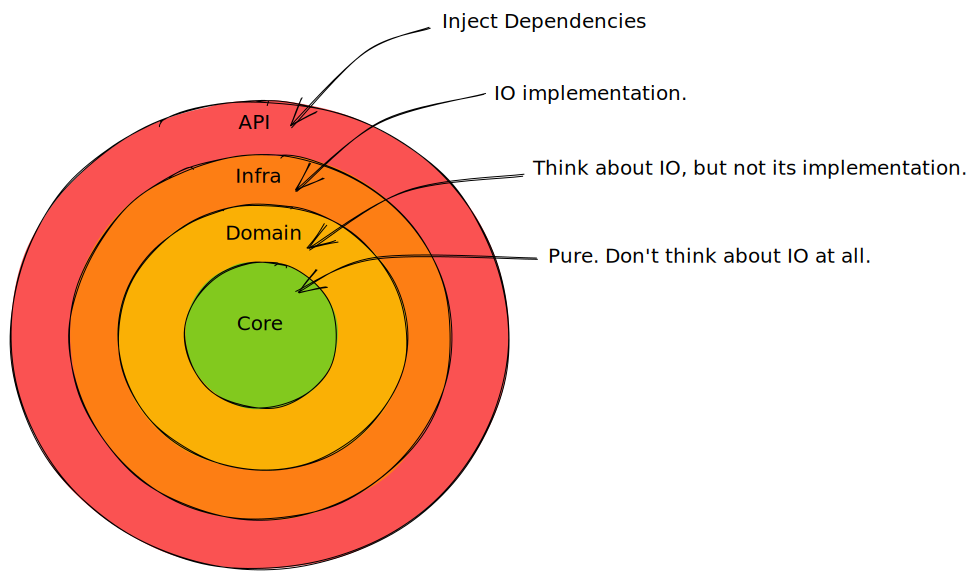
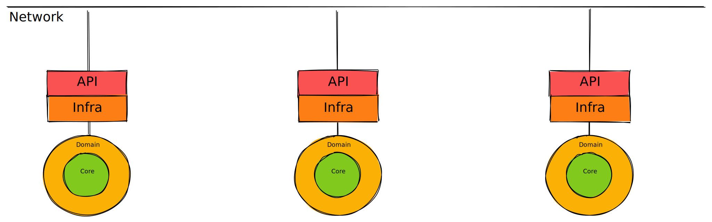

# What comes after Kubernetes?

_[Stuart Harris](../) — 4th January 2021_

Some _good_ things came out of 2020! An exciting one, for me, was the progress that the global collective of open source software engineers has been making towards the future of services in the Cloud.

Microservices are continuing to gain traction for Cloud applications and [Kubernetes][kubernetes] has, without question, become their de facto hosting environment. But I think that could be all about to change.

Kubernetes is really good. But it does nothing to address what I think is one of the biggest problems we have with microservices — the ratio of functional code (e.g. our core business logic) to non-functional code (e.g. talking to a database) is way too low. If you open up the code of any microservice, or ask any cross-functional team, you'll see what I mean. You can't see the functional wood for the non-functional trees. As an industry, we're spending way too much time and effort on things that really don't matter (but are still needed to get the job done). This means that we can't move fast enough (or build enough features) to outpace our competitors.

In this post, I first of all want to explore the Onion architecture, how it applies to microservices and how we might peel off the outer, non-functional layers of the onion, so that we can focus on the functional core.

We'll also see how Kubernetes can be augmented to support this idea (with a service mesh like [Istio][istio] or [Linkerd][linkerd], and a distributed application runtime like [Dapr][dapr]).

Finally, and most importantly we'll ask what comes after Kubernetes (spoiler: a WebAssembly actor runtime) that can support core business logic more natively, allowing us to write that logic in any language and securely connect it to capability providers that we don't have to write ourselves (but could if we needed to).

## 1. The Onion Architecture

Similar to [Hexagonal Architecture][hexagonal-architecture] (also known as "Ports and Adapters") and [Uncle Bob's Clean Architecture][clean-architecture], the [Onion Architecture][onion-architecture] advocates a structure for our application that allows us to segregate core business logic.

Imagine the concentric layers of an onion where you can only call inwards (i.e. from an outer layer to an inner layer). Let's see how this might work by starting at its core.

I've augmented each layer's description with a simple code example. I've used Rust for this, because it's awesome! Fight me. Even if you don't know Rust, it should be easy to understand this example, but I've added a commentary that may help, just in case. You can try out the example from this [Github repository][onion-code].



The _core_ is pure in the functional sense, i.e. it has no side-effects. This is where our business logic resides. It is exceptionally easy to test because its pure functions only take and return values. In our example, our _core_ just a single function that takes 2 integers and adds them together. In the _core_, we don't think about IO at all.

```rust
/// 1. Pure. Don't think about IO at all
mod core {
    pub fn add(x: i32, y: i32) -> i32 {
        x + y
    }
}
```

Surrounding the _core_ is the _domain_, where we do think about IO, but not its implementation. This layer orchestrates our logic, providing hooks to the outside world, whilst having no knowledge of that world (databases etc.).

In our code example, we have to use an asynchronous function. Calling out to a database (or something else, we don't actually care yet) will take some milliseconds, so it's not something we want to stop for. The `async` keyword tells the compiler to return a `Future` which may complete at some point. The `Result` is implicitly wrapped in this `Future`.

Importantly, our function takes another function as an argument. It's this latter function that will actually do the work of going to the database, so it will also need to return a `Future` and we will need to `await` for it to be completed. Incidentally, the question mark after the `await` allows the function to exit early with an error if something went wrong.

```rust
/// 2. think about IO but not its implementation
mod domain {
    use super::core;
    use anyhow::Result;
    use std::future::Future;

    pub async fn add<Fut>(get_x: impl Fn() -> Fut, y: i32) -> Result<i32>
    where
        Fut: Future<Output = Result<i32>>,
    {
        let x = get_x().await?;
        Ok(core::add(x, y))
    }
}
```

Those 2 layers are where all our application logic resides. Ideally we wouldn't write any other code. However, in real life, we have to talk to databases, an event bus, or another service. So the outer 2 layers of the onion are, sadly, necessary.

The _infra_ layer is where our IO code goes. This is the code that knows how to call the database, for example.

```rust
/// 3. IO implementation
mod infra {
    use anyhow::Result;

    pub async fn get_x() -> Result<i32> {
        // call DB, which returns 7
        Ok(7)
    }
}
```

And, finally, the _api_ layer is where we interact with our users. We present an API and wire up dependencies (in this example, by passing our _infra_ function into our _domain_ function):

```rust
/// 4. inject dependencies
mod api {
    use super::{domain, infra};
    use anyhow::Result;

    pub async fn add(y: i32) -> Result<i32> {
        let result = domain::add(infra::get_x, y).await?;
        Ok(result)
    }
}
```

We'll need an entrypoint for our service:

```rust
fn main() {
    async_std::task::block_on(async {
        println!(
            "When we add 3 to the DB value (7), we get {:?}",
            api::add(3).await
        );
    })
}
```

Then, when we run it we see it works!

```bash
cargo run
    Finished dev [unoptimized + debuginfo] target(s) in 0.06s
     Running `target/debug/onion`
When we add 3 to the DB value (7), we get Ok(10)
```

Ok, now we have that out of the way, let's see how we can shed the outer 2 layers, so that when we write a service, we only need to worry about our _domain_ and our _core_ (i.e. what really matters).

## 2. Microservices in Kubernetes

So today, we typically host our microservices in Kubernetes, something like this:


If each microservice talks to its own database in a cloud hosted service such as Azure CosmosDB, then each would include the same libraries and similar glue code in order to talk to the DB. Even worse, if each service is written in a different language, then we would be including (and maintaining) different libraries and glue code for each language.

This problem is addressed today, for networking-related concerns, by a Service Mesh such as [Istio][istio] or [Linkerd][linkerd]. These products abstract away traffic, security, policy and instrumentation into a sidecar container in each pod. This helps a lot because we now no longer need to implement this functionality in each service (and in each service's language).


But, and this is where the fun starts, we can also apply the same logic to abstracting away other application concerns such as those in the outer 2 layers of our onion.

Amazingly, there is an open source product available today that does just this! It's called [Dapr][dapr] (Distributed Application Runtime) from the Microsoft stable and is currently approaching its 1.0 release (v1.0.0-rc.2). Although it's only a year old, it has a very active community and has come a long way already with many community-built components that interface with a wide variety of popular cloud products.

Dapr abstracts away IO-related concerns (i.e. those in our _infra_ and _api_ layers) and adds distributed application capabilities. If you use Dapr in Kubernetes, it is also implemented as a sidecar:



In fact, we can use Dapr and a Service Mesh together, ending up with 2 sidecars and our service (with no networking or IO concerns) in each pod:


Now we're getting somewhere! Our service becomes business logic and nothing else! This is incredibly important! Now, when we look at the source code for our service, we can see the wood — because all the non-functional, non-core, non-business-logic, dull, repetitive, boilerplate code is no longer there.

What's more, our service is now much more portable. It can literally run anywhere, because how it connects to the world around it is the responsibility of Dapr, and is configured declaratively (in Yaml files, just like a service mesh). If you wanted to move the service from Azure to AWS, or even to the edge, you could, without any code changes.

## 3. The Actor model

Once the outer layers have been shed, we're left with a much smaller service, that concerns itself only with doing a job. It's beginning to look a bit like an Actor. Incidentally, Dapr has support for Virtual Actors as well as the services that we already described. This gives us a flexible deployment model for our core logic.

So what is the [Actor Model][actor-model]? Briefly, it's an architectural pattern that allows small pieces of business logic to run (and maintain own state) by receiving and sending messages. Actors are inherently concurrent because they process messages in series. They can only send messages to other actors, create other actors and determine how to handle the next message (e.g. by keeping state). The canonical example is an actor that represents your bank account. When you send it a withdrawal message, it deducts from your balance. The way that the next message is handled will depend on the new balance.

[Erlang OTP][erlang-otp] is probably the most famous example of an actor (or "process") runtime organised in supervisor trees. Processes are allowed to crash, and errors propagate up the tree. It turns out that this pattern is reliable, safe, and massively concurrent. Which is why it's been so good, for so long, in telecoms applications.

The Dapr Virtual Actor building block can place actors on suitable nodes, hydrating and dehydrating them (and their state) as required. There may be thousands of actors running (or memoised) at any one time.

Depending on what type of application we are building, we can run our logic as a service behind the Dapr sidecar, or as actors supervised by the runtime. Or both. Either way, we have written the logic in the language that is most appropriate for the job, and we haven't had to pollute this code with concerns about how it talks with the outside world.

There's only one thing that can make this code even more portable: [WebAssembly][webassembly] (Wasm). Since December 2019 WebAssembly has been the fourth language of the Web, since it [became a W3C recommendation][wasm-w3c].

Imagine if, instead of using Docker containers to wrap our service in its own operating system, we could just compile it to Wasm and run it anywhere.

## 4. WasmCloud

[actor-model]: https://en.wikipedia.org/wiki/Actor_model
[clean-architecture]: https://blog.cleancoder.com/uncle-bob/2012/08/13/the-clean-architecture.html
[dapr]: https://dapr.io/
[erlang-otp]: https://en.wikipedia.org/wiki/Erlang_(programming_language)
[hexagonal-architecture]: https://en.wikipedia.org/wiki/Hexagonal_architecture_(software)
[istio]: https://istio.io/
[kubernetes]: https://kubernetes.io
[linkerd]: https://linkerd.io/
[onion-architecture]: https://jeffreypalermo.com/2008/07/the-onion-architecture-part-1/
[onion-code]: https://github.com/StuartHarris/onion
[wasm-w3c]: https://www.w3.org/2019/12/pressrelease-wasm-rec.html.en
[webassembly]: https://webassembly.org/
