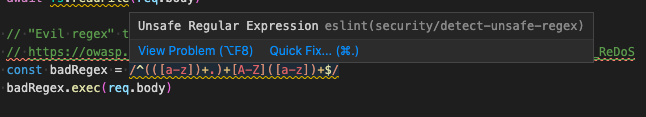
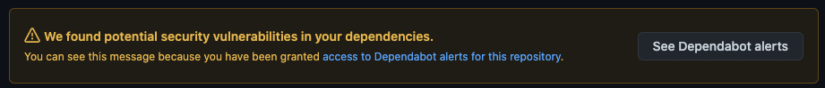
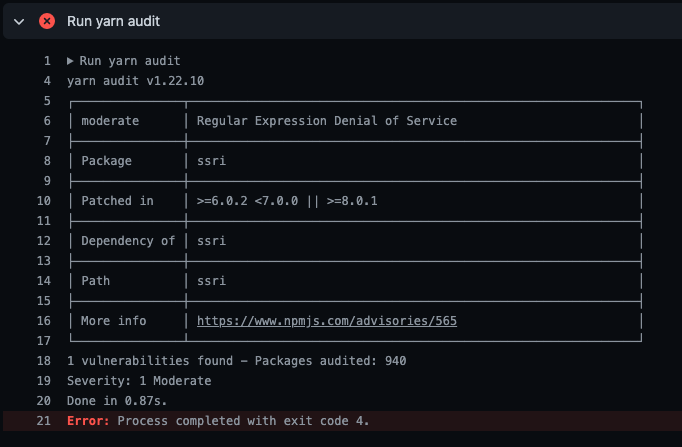

# Safe from the Wolves - building security in
_[Tim Lee](../) — 27th April 2021_

Last week I virtually attended the reasonably interesting [DevOpsCon London](https://devopscon.io/london/) event. My main takeaway is that _Shift Left on Security_ is the current buzz-phrase in the DevOps community, with some suggesting an expansion of the existing merger to create _DevSecOps_. This throws open the door and welcomes in the cold and shivering form of Security, who's been guarding the entrance this whole time and yet never once been offered a cup of tea by Automated Testing and Continuous Integration, who've been merrily sat around, warming their toes by the fire. And it's about time, too.

In a world where automation rules and there's an emphasis on checking for issues early and often to keep the feedback loop tight, it's only natural that security should be brought into the fold, especially when the number of wolves prowling the streets, looking for straw houses full of little piggies to blow over, continues to grow.

There are many tools we can use to ensure that our house is built of bricks, which I will discuss in this article. 

The key prerequisite of anything we use is that it must be able to run in a pipeline as part of a CI build in order to act as a gatekeeper, preventing possible issues from making it into the codebase. Also, I've  limited my research to free and open source options because that's just how we roll, but there are some pretty comprehensive paid options which may dance all over the competition.

It's also important to note up-front that security is a hard thing to get right and vulnerabilities can take many forms, so we're certainly not going to catch every issue, but if we can keep our attack surface area small and identify and fill as many holes as possible then it might just be worth it.

## The challenge

To put the various tools to the test, I created a template typescript [NextJS](https://nextjs.org/docs/api-reference/create-next-app) project with associated Github Action for CI and introduced a number of delicious, security-related bugs on a feature branch, including:
  - a selection of the most pernicious [according to OWASP](https://owasp.org/www-project-top-ten/) (The Open Web Application Security Project)
    - an "evil regex" that can lead to a RegEx denial of service attack
    - `SELECT` SQL statement with user-generated content (SQL-injection attack)
    - returning raw server error messages to the client
    - an outdated, insecure dependency (SSRI v6.0.1)
    - a hardcoded private key
  - some Javascript/React-specific issues
    - `eval()` with unsanitised user-generated content
    - `dangerouslySetInnerHTML` with user-generated content (XSS attack)
  - some misconfigured Terraform resources, including hardcoded keys

You can check out the code [here](https://github.com/TimboTambo/security-tooling/pull/1), to see both the bugs and the configuration for each Github action.

## The tools

### Static Application Security Testing (SAST)

Many security issues arise from bad but often-repeated patterns, meaning that we can scan the code using a list of rules written as regexes to identify likely vulnerabilities - this is essentially what static code analysers do. This kind of test is referred to as [white-box testing](https://en.wikipedia.org/wiki/White-box_testing), with _white_ as in transparent, since it tests from an internal perspective with access to the source-code.

There are a [large number of analysers recognised by OWASP](https://owasp.org/www-community/Source_Code_Analysis_Tools) that cover a range of languages, use cases and budgets.

#### LGTM

The first one I tried was [LGTM](https://lgtm.com/) since it's free (for open-source projects), can scan Javascript and integrates nicely with Github. Once you log in with a Github account it's quick to set-up - you just have to give authorisation for Github organisation access and point to the repository to run tests against and you're away. A scan will be performed for every merge to the main branch and (once switched on) any pull requests. 

Of the 8 or so issues in the PR code changes, it only identified a disappointing 2 (evil regex and the XSS vulnerability). Despite these "alerts", it did not label the check as failing and I could not see any way to configure the threat tolerance level, making it a bit redundant for enforcing best security practices in a live project.

#### Insider

This open-source project is a bit more light-weight and is available as both a CLI and Github Action, although the low verbosity of output of the Github action is enough to know there are issues but not what those issues are, which would slow down debugging and remediation.

It found 3 issues in the JS code (two hardcoded secrets - a private key and DB password, and reading from a non-static, user-provided file name), identified the vulnerable dependency and picked up the hardcoded secrets in the Terraform config, so definitely more effective than LGTM, but still some holes.

#### ES-lint

The ability of this versatile and thoroughly effective JS/TS linter to accept plugins makes it an ideal security scanner, because applying rules to code is what it was made for. Furthermore, it can show errors and warnings directly in your IDE (shortening the feedback cycle considerably), it can prevent committing when there are detected issues with a pre-commit hook and also run as a pipeline step with no extra configuration.

A number of plugins are available to enforce security-related rules, including:
-  eslint-plugin-security - solid set of security checks
-  eslint-plugin-scanjs-rules - additional rules from Mozilla's deprecated ScanJS product

Using these plugins identified 4 of the issues in the JS code. Compared to the previous two tools, and given the possibility of writing additional, custom rules, this option is probably the simplest, leanest and most effective way of adding a safety net to the coding process.

#### Verdict

ES-lint > Insider > LGTM. ES-lint uncovered all code issues found by Insider (except the Terraform and dependency issue, which can be covered by other tools discussed later). Though it only found 1 of the 2 issues found by LGTM, a custom rule could easily cover the XSS issue, which is only a small trade-off considering ES-lint is so easy to configure and you're probably already using it anyway.

### Secrets scanners

While some of the above SAST applications detect secrets, there are also a category of tools that are dedicated to the pursuit.

#### Trufflehog

[Trufflehog](https://github.com/dxa4481/truffleHog) is a Python-based CLI for scanning secrets using entropy (identifying strings with high variability, such as `wJalrXUtnFEMI/K7`, which is characteristic of a password) and 19 regex patterns matching common private and API keys. It seems well known in secret-scanning circles and has spawned an [associated Github action](https://github.com/edplato/trufflehog-actions-scan) and Rust version of the CLI tool called [Rusty Hog](https://github.com/newrelic/rusty-hog).

The CLI takes a public Github repository URI as it's argument rather than scanning local files, which makes it less useful for local checks. It also doesn't seem to work against branches, nor does the Github action, making it less than useful as part of a CI safeguard.

#### ES-lint

ES-lint to the rescue again! With the installation of the `eslint-plugin-no-secrets` plugin, all secret checking can be performed as part of the regular linting process. Like Trufflehog, it uses entropy and pattern matching to identify secrets and it does it very well, picking up the hardcoded keys in the test code (within the JS files, at least).

#### Verdict

ES-lint > Trufflehog

### Dependency checkers

One of the biggest threats in most JS-based projects is the extensive use of third-party libraries, with little-to-no regulation or protection against malicious actors or compromised packages. With a constant cycle of patched versions being released, it's easy to fall behind and so end up with known vulnerabilities in your project.

This is where dependency checkers come in, scanning your packages for versions with known issues.

#### Dependabot

[Dependabot](https://dependabot.com/#how-it-works) is one of the best known dependency checkers. It's easy to set up through Github and periodically checks the project's installed package versions against the latest problematic dependencies, notifying you when it finds anything and even (if configured) automatically creating pull requests to update to the latest, safest versions.

This is great for ongoing security, since other tools will generally only check new pull requests, however the list of known vulnerabilities is constantly changing and more dormant projects could easily fall behind without realising it.

This does not necessarily protect against the issue of [typosquatting](https://blog.scottlogic.com/2018/02/27/hunting-typosquatters-on-npm.html), where hackers will upload dodgy code to npm with names very similar to popular packages (such as _crossenv_, _mongose_ and _expres_) to pounce on any fat-fingered developer who mis-types a package name during installation, as the compromised code may already be in production by the time Dependabot runs its checks.

#### yarn audit / npm audit

Both `yarn` and `npm` package managers have a built-in function called `audit` to catch known issues, making it really simple to add as a pipeline step or pre-commit hook. 

This easily caught the insecure package in my test repo, with a clear debug message and indication of severity.

#### Verdict

The limitation for both these tools is the _known_ part - there is always that stage before issues are found where you're wide open. But staying up-to-date is better than nothing, and there's a seat available on both the Dependabot and audit trains into safety town. Just watch out for bandits.

### Container vulnerability checker

As with third-party packages, when using or building on top of a public Docker image, there's always the possibility that the registry image contains some nasty things that want to hurt you. This is where a container scanner comes in handy...

#### Anchore Grype

This [open source CLI tool](https://github.com/anchore/grype) from Anchore has a [Github action](https://github.com/marketplace/actions/anchore-container-scan) that's really simple to configure and executes very quickly (under 20 seconds).

As well as checking the base image, it also doubles as a dependency checker and scanned all the node modules too, catching the dodgy SSRI dependency, plus 17 more possibly problematic packages including some with critical issues... updating to latest only fixed 1 of them (the deliberate vulnerability).

#### Verdict

Anchore in particular may be too sensitive to use as a CI security gate when including dependencies, since the pipelines would be blocked, with no way to resolve the issues if fixes aren't available, so this tool might be better left to scanning base images before copying or installing any third-party libraries.

### Infrastructure checker

You can spend a lot of time cementing the cracks in your walls, but if you leave the window open then it's really all for nothing. Locking down your code is important, but just as (or if not, more) important is ensuring your infrastructure is solid, making adequate use of encryption, service accounts and private networks.

One of the many benefits of using infrastructure-as-code is that our resources are configured in a visible, controllable, auditable way that can be statically analysed in the same way as our code. This is where infrastructure checkers come in, like…

#### Checkov

[Checkov](https://www.checkov.io/) is an open source tool from Prisma Cloud (subsidiary of Palo Alto Networks) that can scan all of the most common types of cloud configuration files, including Terraform, AWS, GCS, Aure, Kubernetes and Helm. 

The Github Action couldn't be any easier to set up, it runs quickly (2s for my small sample file) and picks up many valid issues, such as missing key security parameters, encryption options set to false, lack of monitoring and hardcoded secrets. 

You can choose to skip specific checks and pass the build even on failures (soft fail), but what seems to be missing is an acceptance threshold, where only errors (instead of warnings) fail the build.

#### Verdict

For the small overhead and thorough feedback, this definitely seems like something worth setting up for any project involving infrastructure configurations. Whether it proves useful or the failure on warnings that you consider to be no big problem quickly leads to enabling soft fail is a different matter.

### Bonus: Kubernetes threat detection engine

In researching the various types of security tooling, I came across [Falco](https://falco.org/), a CNCF-managed, open-source security tool that can run on a pod in your Kubernetes cluster and catch dodgy-looking behaviours, such as privilege escalation and execution of shell or SSH binaries. 

I didn't try it out, but it looks really nice and fits the belt-and-braces model of defence-in-depth. I imagine it would be reassuring to know there's a guard on duty while everyone else is sleeping.

### Conclusion

This article covers only a partial cross-section of the wide and varied world of security tooling, but hopefully shows that there are many effective, light-weight options for identifying vulnerabilities as part of our existing development workflows that should help more than they hinder. 

Of course, many security bugs will dip and dodge past the full arsenal of automated testing, meaning that we must always be studious in our security education, attentive in our code reviews and vigilent in production. However, by accepting and embracing security to bring the Sec into DevOps, we give ourselves, and our users, the best chance of protection from the wolves - that has to be worth the effort, right?
